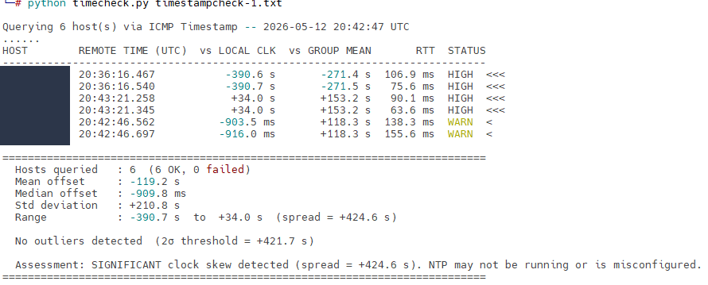

# icmp-timestamp

A small toolkit to convert ICMP Timestamp (type 13/14) replies into human‑readable times and to report clock offsets.

This repository contains:
- `timecheck.py` — a Python/Scapy-based tool that queries ICMP Timestamp and reports NTP-style offsets.
- `icmp-timestamp.sh` — a Bash helper that converts numeric millisecond timestamps to human-readable UTC datetimes.
- `pry_bar.sh` — a small driver that uses `hping3` to probe hosts, parses RTT/timestamp values, and calls `icmp-timestamp.sh`.

---

## Prerequisites

- Python 3.8+ and `pip` (for `timecheck.py`).
- `scapy` Python package (install via `requirements.txt` or directly).
- `hping3` for the Bash flow (`pry_bar.sh` and direct `hping3` use).
- Elevated privileges (root / sudo) are typically required to send/receive raw ICMP packets.

### Install system packages (examples):

#### Debian / Ubuntu (For bash script using hping3)

```
sudo apt update
sudo apt install -y hping3
```

#### macOS (Homebrew)
```
brew install hping
```
#### Python (For Python script using scapy)
```
python3 -m pip install -r requirements.txt
```


---

## Using the Python tool (`timecheck.py`)

`timecheck.py` uses Scapy (AF_PACKET) to send ICMP Timestamp requests. It usually requires sudo.

Examples:

Query hosts from a file (one host per line)

```
sudo python3 timecheck.py hosts.txt
```

With a 3 second timeout and verbose per-host timing

```
sudo python3 timecheck.py hosts.txt --timeout 3 --verbose
```

Write results to CSV

```
sudo python3 timecheck.py hosts.txt --csv results.csv
```


`timecheck.py` prints a compact table of remote times, offsets vs local clock, RTTs, and a simple assessment.




---

## Using the Bash flow (`hping3` + `pry_bar.sh` + `icmp-timestamp.sh`)

`pry_bar.sh` drives `hping3`, extracts round-trip min/avg/max values, and calls `icmp-timestamp.sh` which converts numeric millisecond timestamps into human-readable times.


Notes:
- `hping3` requires root privileges — run with `sudo`.
- `pry_bar.sh` parses `hping3` output for `round-trip min/avg/max`. It prints per-target RTTs and forwards them to `icmp-timestamp.sh`.
- `icmp-timestamp.sh` expects numeric millisecond timestamps (or values parsed by `pry_bar.sh`) via `-O` (Originate), `-R` (Receive), `-T` (Transmit). Example:


---
